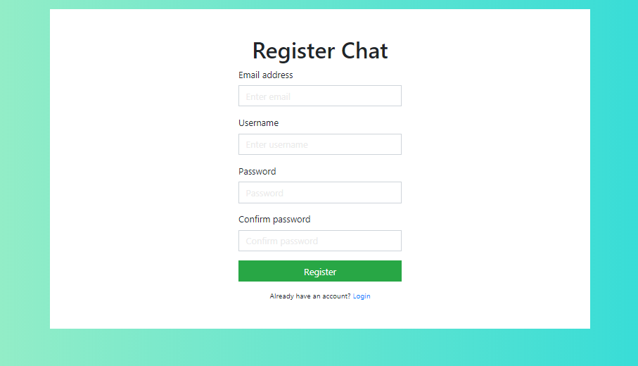
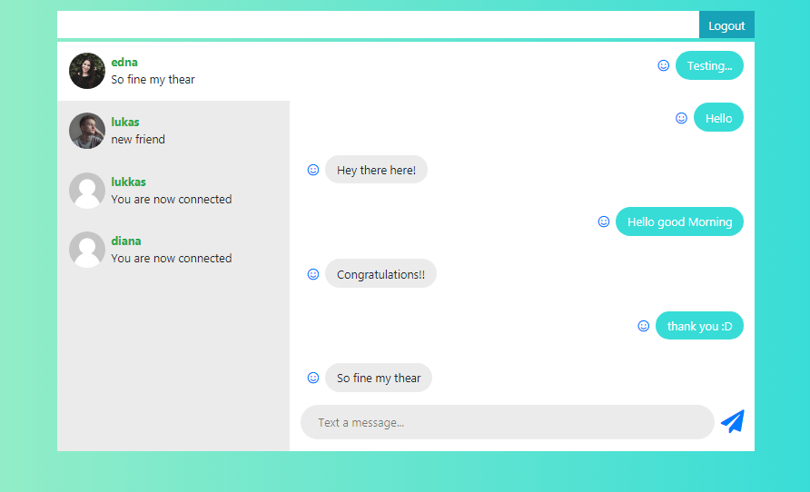

# Chat-platform
Basic chat platform with NodeJS, React &amp; GraphQL

### Preview





### Requirements

- In a new project, install the apollo-server and graphql dependencies using:

```
npm i apollo-server graphql
```

- Sequelize ORM

```
$ npm i --save sequelize

$ npm i sequelize-cli -g

$ npm i --save mysql2
```

### Sequelize model

```sh
$ sequelize model:generate --name User --attributes username:string,email:string

$ sequelize model:generate --name Message --attributes content:string,uuid:uuid,from:string,to:string

$sequelize model:generate --name Reaction --attributes content:string,uuid:uuid

$ sequelize db:migrate

```

### Test Data seeders

```sh
$ sequelize seed:generate --name create-users

$ sequelize seed:generate --name create-messages

$ sequelize db:migrate:undo:all

$ sequelize db:migrate

$ sequelize db:seed:all

```

### Install

```
npm i && cd client/ && npm i
```
### run

```
npm run dev

cd client/

npm run start
```